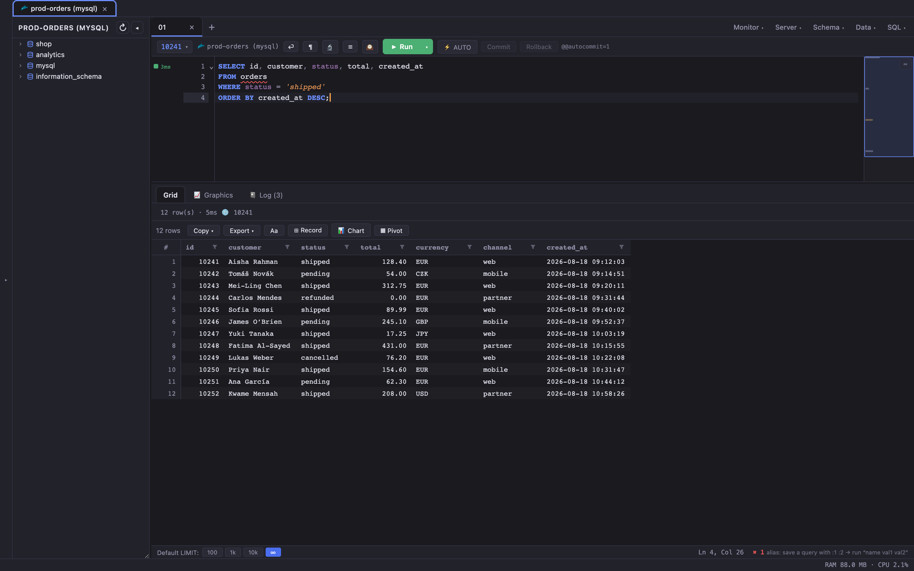

# TxUI


> **[No AI used for this text]**
>
> TxUI is the embodiment of a long-standing wish: to have a first-choice UI for my needs — at work, at home, anytime.
>
> The last few years have opened the floodgates to AI slop, half-baked AI projects, and dead ends. I'm trying to counter that by drawing on my own experience — verifying, cross-referencing, testing, and staying genuinely cautious about outcomes.
>
> It offers a smooth, fast querying experience, with excellent navigation inside the editor and advanced functionality throughout.
>
> Plugins for common tasks add something new — a "special open" for Dolphie files, map/graph views for geo-data, pivot tables, and more.
>
> The UI is built for high-privilege users, covering everything an admin or DevOps engineer needs to do within the database space.
>
> This is a hobby project — a one-man show, fueled by enthusiasm and no shortage of tokens to spare.
>
> I genuinely believe this version is perfectly usable as-is, right now (September 2026), and can only grow from here.
>
> -Tuxie-
>
> P.S. About the name — Tx is short for Tuxie, and also short for (database) transaction ;-)



## What it is

- **A fast, DBA-focused desktop database GUI** — Tauri 2 + Rust + React 19; native-speed core, ~40 MB bundle, ~100 MB idle RAM, cold start under a second.
- **Nine engines, one app** — MySQL / MariaDB / Percona, PostgreSQL, Redis, ClickHouse, SQLite, DuckDB, MongoDB, SQL Server, and Parquet files.
- **FastGrid** — one grid virtualized on both axes for every tabular surface; 60 fps at 1M rows, selection-aware copy/export in 6 formats.
- **A real SQL editor** — CodeMirror 6 with schema-aware, alias-aware completion that quotes what it inserts, hover docs, signature help, live squiggles (unknown column, JOIN without ON, WHERE-less write…).
- **Statement-at-caret execution** — multi-statement scripts with per-line timing, run-to-cursor, and drafts that survive a restart.
- **Processlist + kill** — live processlist with a long-query watchdog that detects, tracks and explains runaway queries; lock chains and a deadlock wait-for graph.
- **The DBA layer** — replication dashboard, server variables & status, interval monitor with sparklines, curated sys / performance_schema / pg_stat views.
- **Server tuner** — MySQLTuner-style health score with guided fixes, per engine (MySQL, PostgreSQL, ClickHouse, Redis, SQLite).
- **Query Store (SQL Server)** — plan history, regressions ranked by time wasted, side-by-side plans, one-click plan forcing.
- **EXPLAIN, visualized** — plan tree plus SQL Quality reports: lint, type audit, integer ceilings, guarded EXPLAIN ANALYZE.
- **GIS data on a real map** — MySQL spatial and PostGIS geometries decoded client-side (no `ST_AsGeoJSON` round trip, works on old servers too). The 📈 Graphics tab appears on **any result with rows, on every engine**: plot coordinates on a map with time-scrubbed track playback, or chart the result. The basemap is drawn locally by default — online tiles are a disclosed opt-in, because tile requests leak where your data is.
- **Dolphie replay recordings** — open a Dolphie `daemon.db` (SQLite) and TxUI recognizes it: not four opaque tables but a MySQL server as a time series — per-second processlist, global status, metadata locks, variable changes, ZSTD-dictionary decoded, read-only, with a Raw↔Replay toggle.
- **Schema tooling** — interactive ER diagram, schema/instance comparison with migration-script generation.
- **Data generator** — 76 generators with real distributions and chart-ready presets; server-side INSERT…SELECT up to a billion rows.
- **Fleet operations** — multi-server execution, immutable audit log, saved queries, query history.
- **Safety by default** — prod environment tags with row-count confirmations, server-side write guards, read-only enforced at the driver level, SSH tunnels, optional encrypted vault.
- **Same app on all three desktops** — native File · Edit · View · Tools · Help everywhere, SQLite compiled into the binary so a `.db` behaves identically everywhere.

## Develop

```bash
npm install                      # once
cd src-tauri && cargo tauri dev  # hot-reload dev app
```

## Verify

```bash
npx tsc --noEmit -p tsconfig.app.json   # typecheck (the -p is NOT optional)
npm run lint && npm run build
npm test                                # unit tests — needs Node ≥ 23 (type stripping)
cd src-tauri && cargo test --lib        # backend unit tests
```

## Release builds

- **CI** (Actions → release): push a `v*.*.*` tag → macOS (universal), Linux
  (AppImage/deb) and Windows (NSIS/MSI), drafted as a GitHub Release.
- **Local**: `crossbuild/build_linux.sh` here, `build_macos.sh` on the Mac,
  `build_windows.sh` cross-builds Windows from either.

Internal design docs are kept out of this repository by design.
